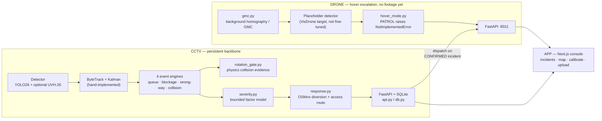

<title>Sentinel — ELCIA Smart City Drone-AI Challenge</title>

# Sentinel — Road Incident Intelligence

**ELCIA Smart City Drone-AI Challenge 2026 — Problem Statement 1: Smart Mobility & Road Incident Intelligence.**
Detect queues, blockage, wrong-side movement, and accident-related congestion from traffic video; classify
incident type and severity; show location-aware alerts; recommend diversion, response, and escalation
workflows.

This README explains *why* the system is built the way it is — every architectural decision below was
reached by building something else first, measuring it honestly, and rejecting it for a stated reason.
That trail is the actual engineering story, and it is deliberately kept visible rather than cleaned away.
Every screenshot and clip below is a real, unedited output of this repo's own code — none are mockups.

## Contents

1. [What this repo is](#1-what-this-repo-is)
2. [Live demo](#2-live-demo) — screenshots, GIF, operator console
3. [Architecture at a glance](#3-architecture-at-a-glance)
4. [Why CCTV-first, not drone-first](#4-why-cctv-first-not-drone-first)
5. [Sensor selection — what we rejected, and why](#5-sensor-selection--what-we-rejected-and-why)
6. [CCTV architecture — two systems merged](#6-cctv-architecture--two-systems-merged-and-why-this-direction)
7. [Drone — built ahead of footage](#7-drone--built-ahead-of-footage-honestly-labelled-as-such)
8. [What we rejected in the wider evaluation](#8-what-we-tried-and-rejected-in-the-wider-evaluation)
9. [Validation ideas tried, kept honest](#9-validation-ideas-tried-kept-honest)
10. [CPU-first — where we are against that goal](#10-cpu-first--where-we-are-against-that-goal)
11. [Future scope](#11-future-scope)
12. [Run it yourself](#12-run-it-yourself)
13. [Repo map](#13-repo-map-in-one-table)

---

## 1. What this repo is

```
FINAL/
├── CCTV/    fixed-camera pipeline — the persistent backbone, the primary deliverable
├── DRONE/   moving-camera scaffolding — hover-based escalation, built ahead of real footage
├── APP/     Next.js operator console — incidents, map, evidence, calibration, upload
└── DEMO/    5-minute video script, jury walkthrough, honest results summary, curated clips
```

`CCTV` is a merge of two independently-built systems (§6). `DRONE` has no footage yet and is
built to run mechanically today with a placeholder detector, ready to receive real weights and
clips without changing its shape (§7). `APP` is a from-scratch React rebuild of two working
vanilla-JS dashboards, talking to `CCTV` and `DRONE` as two separate backend processes.

---

## 2. Live demo

### Physics evidence, not a bounding-box demo

Every collision claim below carries its full evidence trail on screen — per-vehicle speed,
trajectory, rotation/aspect shock, contact geometry, interaction type — because a red box with no
numbers behind it is not a claim a jury (or an operator) should trust.

<table>
<tr>
<td width="50%">

**Our 4/4 ground-truth-confirmed result** (`IDEAS/COMBINED`, videos 4/11/13/14 — the original
physics engine before this repo's merge, `DEMO/clips/cctv_positive/`)


`TOP #1287↔#1303 · 0.392 · crossing · rel=53.0° · gap=−0.48 · << CONTACT`

</td>
<td width="50%">

**Same physics engine, running live inside the merged pipeline** for the first time, on a clip
neither system had seen before (`CCTV/demo/`, full write-up in `CCTV/demo/README.md`)


Per-vehicle evidence score, speed in **px/s and a labelled km/h estimate**, trajectory trail, all
computed in-process against NETRA's own live tracker output — no offline files, no pre-computed
JSON.

</td>
</tr>
</table>

**The engine live, frame by frame** (2.5 s clip from the render above — this is the actual output
video, not a staged capture):


Full-resolution renders for all 5 first-look clips (including one **confirmed false positive**,
documented rather than hidden) are in [`CCTV/demo/`](CCTV/demo/README.md); our 4 original
ground-truth clips are in [`DEMO/clips/cctv_positive/`](DEMO/clips/cctv_positive/).

### The operator console — real screenshots, backend actually running

Every screenshot in this section was captured against **live, running backends** (`run.py serve`
on :8000, `DRONE/scripts/api.py` on :8011) — not a static mockup. The green `CCTV UP` / `DRONE UP`
indicators in the top-right of every screenshot are a real, polled health check.

<table>
<tr>
<td width="33%">

**Map — diversion + access routing**

The UI honestly states *"NOT AVAILABLE — no access-route endpoint exists in the backend"* — degradation is visible, not hidden.

</td>
<td width="33%">

**Incidents feed**

Genuinely empty — this server instance hasn't had footage run through it yet. See §2's video renders for actual detections instead of a faked feed.

</td>
<td width="33%">

**Drone page — honest not-ready state**

States **NOT IMPLEMENTED** and explains *why* (top-down vs eye-level appearance mismatch) inline, in the product itself — not just in this README.

</td>
</tr>
</table>

<details>
<summary><b>Overview and CCTV console pages</b></summary>

 

</details>

---

## 3. Architecture at a glance



The dispatch arrow (CCTV → DRONE) is the architectural claim, not a wired integration yet —
`CCTV/netra/response.py` and `netra/events/rotation_gate.py` are built and tested standalone but
not yet called from `api.py`/`collision.py`. Stated exactly this way in §6 and §13, not glossed over.

---

## 4. Why CCTV-first, not drone-first

The competition is named the *Drone-AI Challenge*. We built a fixed-camera system anyway, and the
reasoning is load-bearing enough to state plainly before anything else:

- **Endurance.** Consumer/prosumer drones fly 20–40 minutes per battery; industrial airframes
  reach 1–2 hours. Persistent coverage of even one junction needs a rotating fleet, charging
  infrastructure, and pilots or autonomous-flight certification — for a job a ₹2,000 fixed camera
  already does forever.
- **Regulation.** Indian DGCA rules currently approve BVLOS (beyond-visual-line-of-sight,
  i.e. unmanned) operation only for narrow pre-approved corridors — mineral survey in Ladakh,
  pharma delivery in Telangana, coastal monitoring in Andhra Pradesh, logistics in Uttarakhand and
  Gujarat. **Traffic monitoring is not among them.** Standard operation requires visual line of
  sight and a 120 m altitude cap. A drone continuously patrolling city roads unmanned is not
  currently a legal deployment in India for this use case.
- **Domain precedent.** UVH-26 — the flagship India-traffic dataset from AIM@IISc, built for
  exactly this problem — is sourced from **~2,800 fixed Bengaluru Safe-City CCTV cameras**, not
  drone footage. The domain experts who built the reference dataset for this exact problem made
  the same call.

The resolution we landed on: **CCTV is the persistent backbone; the drone is a hover-based
escalation/verification asset**, dispatched to a location a CCTV camera has already flagged, for
long enough to confirm it — minutes, not hours, which is well within any drone's endurance and
consistent with how the standard research benchmark for this task actually operates (the
`Drone-Anomaly` dataset is explicitly documented as "mainly captured by hovering UAVs," not
patrol footage). This is encoded as an enum in the code, not left as a design note —
`DRONE/scripts/hover_mode.py` implements `HOVER` and makes `PATROL` raise `NotImplementedError`
with this exact reasoning in its docstring — visible live in the drone screenshot in §2.

---

## 5. Sensor selection — what we rejected, and why

Before writing any detection code we worked out, from first-principles physics, what a drone at
**100 m altitude with a 24 mm-equivalent lens (73.7° HFOV)** can actually resolve. At that
geometry a 4K frame gives **3.91 cm/pixel**, so a 4.5 m car is **115 pixels long** — the number
every sensor below is measured against.

| Sensor | Why rejected | The number that killed it |
|---|---|---|
| **mmWave radar** | Wavelength ~7,000× longer than light, so matching camera resolution needs a **10 m antenna**. Radar also only measures motion *toward/away from itself* — directly under a hovering drone, a car's true velocity is perpendicular to the line of sight, so radial velocity reads **zero** (the same blind spot every airborne down-looking GMTI radar has ever had to solve with a side-looking array, e.g. JSTARS' 7.3 m side array). | Cross-range resolution at 100 m: **1.75 m** — one blob per two motorcycles |
| **LiDAR** | Fixed dot budget. Wide coverage (a whole junction) starves each car; narrow beam gives density but only sees a 5 m-deep stripe of road, never both. On a flat road, depth is *already known exactly* from a 4-point homography — LiDAR answers a question already solved. | **9 dots per car** in wide/junction mode vs 115 camera pixels |
| **Stereo cameras** | Depth error grows with the *square* of range. At 100 m, error exceeds twice the length of the car being measured, and fixing it needs a baseline wider than the drone itself. | **±9.8 m depth error**; needed baseline **3.9 m** |
| **Thermal (LWIR)** | 6× fewer pixels than RGB at the same coverage — 19 px/car, enough to say "something is there," not enough to measure motion. On a hot Bengaluru afternoon, car and asphalt reach the same temperature ("thermal crossover") and the car vanishes regardless of sensor sensitivity. None of the four required detections (queue/blockage/wrong-way/accident) is a heat phenomenon. | **19 px/car**; no public aerial thermal traffic dataset exists at all |
| **SWIR** | Same 19-px pixel deficit as thermal (same small, expensive detector arrays). Its fog advantage is a long-slant-path effect that mostly evaporates over a 100 m straight-down path; against real fog (droplet size 1–20 µm) it scatters almost as badly as visible light (Mie, not Rayleigh, regime). | **19 px/car**; ₹8–20L indicative cost, unverified exact figure |
| **NIR illumination** | Inverse-square law: lighting a doorway at 1 m with 10 W needs **100 kW** at 100 m — a 100 Wh drone battery can't do it. Removing the IR-cut filter also desaturates daytime colour, destroying exactly the cue that tells a yellow auto-rickshaw from a white hatchback. | **10,000×** more power needed at range |
| **Event cameras (DVS)** | Efficient only when the *background* is static — the entire point of the sensor. On a moving drone the whole frame "moves," so every textured pixel fires and the sparsity advantage inverts into a flood. Also: no brightness output at all, so no vehicle classification, no evidence image (a submission requirement). Its real strength — microsecond timing — answers a question traffic never asks (our slowest requirement is a 30–120 s queue, needing ~0.02 Hz; DVS offers ~1 MHz, five to six orders of magnitude more than needed). | Saturates a 1.6 Gbps interface under platform motion |
| **Hyperspectral** | Most airborne hyperspectral sensors are pushbroom — they need forward flight to build an image line by line. A hovering drone (our own operating mode, §4) produces **zero image**. Splitting light into 200 bands also starves each one of photons; the only fix is a longer exposure, which turns a moving car into a 476-pixel motion streak. No physical mechanism connects a traffic incident to a spectral signature — the incident is *where things are and how fast*, not *what they're made of*. | Photon loss **66.7×** vs RGB → forced exposure smears a 60 km/h car into a **476 px** streak |

**What survives: RGB optical, for both platforms.** Thermal keeps one narrow, explicitly-scoped
role — `DRONE/scripts/thermal_presence.py` is a stub for total-darkness *vehicle-presence*
triggering only, never classification, motion, or severity, useful on unlit rural stretches where
India's street-lighting coverage is inconsistent outside city cores.

---

## 6. CCTV architecture — two systems merged, and why this direction

Two collision-detection systems were built independently before this repo existed, and both were
measured honestly before either was chosen.

### System A — our physics-first collision engine

Built in `IDEAS/COMBINED` (not in this repo — the winning algorithm was ported in, see below).
Started from a documented failure: 1 correct pair out of 4 ground-truth-labelled videos. Three
measured fixes took it to **4/4 top-1 correct** (see §2 for the actual rendered output):

1. **Rotation as a multiplicative gate, not an additive term.** The physical insight: *braking
   decelerates you along your own axis; being struck rotates you.* A vehicle with no rotation
   keeps only a small floor of its kinematic score, however hard it decelerated — this is what
   demotes a driver braking to avoid a crash ahead from being mistaken for the crash itself.
2. **Interaction geometry from relative heading.** Crossing (45–160°, the classic T-bone) is
   treated very differently from oncoming (160–180°, usually two vehicles safely passing whose
   2-D boxes overlap because a box can't encode depth) or following (0–45°, usually queuing).
   This is a *prior* on how much evidence to demand, never a veto.
3. **A track that dies at the contact instant is evidence, not missing data** — the tracker lost
   it *because* the vehicle deformed and rotated, and the system now treats that termination as a
   substitute for the rotation it couldn't directly observe.

On a properly constructed 12-positive/19-negative split (see `IDEAS/COMBINED/RESULTS.md`),
physics alone reached **F1 0.76**, fused with an appearance CNN and an optical-flow channel,
**F1 0.86**, with **0 false alarms on 19 negatives**. Every number carries its own caveat in the
source docs — 4 ground-truth videos is a small sample, and thresholds were tuned on those same 4
videos, so none of this is held-out evidence. It is reported that way deliberately.

**What System A did not have:** queue, blockage, or wrong-way detection at all; no working
diversion routing wired to it; no portable packaging (6+ hardcoded absolute paths, no
`requirements.txt`, a hard dependency on an offline pre-computed tracking file and an external
cloned repo's log file for one optional signal).

### System B — NETRA, the teammate's broader engine

A second, independently built system covering all four required event types with real engineering
discipline: hand-implemented ByteTrack + Kalman filter (not a library import, for auditability),
auto-calibration that learns road corridors from ~90 seconds of observed traffic with no
segmentation model, a connected FastAPI + SQLite dashboard with real usage history, 1,066 lines of
tests, and an honest self-graded readiness document.

Its own measured numbers (`LIMITATIONS.md`): **11/15 collision clips detected, 8/15 with the
correct vehicle named**, but **155.8 false alarms per hour on crash-free footage**, and — critically
— its own gate sweep showed **no threshold fixes this**: raising the gate enough to kill the false
alarms drove real-collision recall to **0/15** before it touched the false-alarm rate. This is
precisely the failure mode System A's rotation gate was built to solve.

### The merge

**NETRA is the skeleton this repo's `CCTV/` is built from; System A's rotation-gate module is
transplanted in as the primary collision-evidence channel**, not the reverse — three of the four
required event types only ever existed in NETRA, along with its auto-calibration, its connected
dashboard, and its real dependency management. Rebuilding all of that around a collision-only
codebase would have meant redoing work that already existed and was already measured.

`netra/events/rotation_gate.py` is the ported, adapted algorithm — rewritten to consume NETRA's
live `Track` objects in-process (`score_pairs(tracks, cfg) -> list[PairResult]`), eliminating
System A's offline-file dependency entirely rather than just relocating it — this is the exact
code producing the §2 first-look screenshots. `netra/response.py` carries over System A's
OSMnx-based diversion routing (provably avoids the incident by removing its own graph node before
computing shortest path) plus a clearly-labelled *simulated* responder access route, since NETRA
had no working routing for its own clips at all — visible live in the §2 map screenshot.

**The false-alarm problem is not yet declared solved, and the first live test proved it out
immediately.** Running the merged pipeline on 5 fresh NETRA clips for the first time (§2, full
detail in `CCTV/demo/README.md`) surfaced a **confirmed false positive**: a Traffic-category
(crash-free) clip scored **0.738 — the highest score of the set** — traced to 227 tracker IDs over
221 frames of queued traffic and a spurious 1915 px/s reading on a visually-stationary vehicle.
Rotation-gate alone has no defence against tracker identity-switch noise; this is exactly why the
plan is to require rotation-gate agreement with at least one of NETRA's two independent geometric
channels before a collision is `CONFIRMED` rather than `POSSIBLE`, mirroring System A's own
spatio-temporal agreement-bonus idea. This must be re-measured on the combined clip set before any
number is quoted as this submission's number — pre-merge numbers from either source system are
reported above as history, not as claims about the shipped system. See
`DEMO/results_summary.md` for the line separating "measured" from "must be re-measured."

---

## 7. Drone — built ahead of footage, honestly labelled as such

No drone footage exists yet. `DRONE/` is built so the pipeline runs mechanically today and drops
in real weights/clips later without changing shape — every stubbed piece is loudly flagged in both
code and its own JSON output (`detector_finetuned: false`, `telemetry_available: false`), never
silently assumed to work, and visible live in the §2 drone-console screenshot.

**The core unsolved problem drone footage introduces: recovering vehicle speed from a moving
camera.** Two convergent, literature-grounded approaches:

1. **Chained background-homography / camera-motion-compensation (GMC)**, implemented in
   `DRONE/scripts/gmc.py`: mask out detected vehicles, feature-match (ORB/RANSAC) the *static
   background only* between consecutive frames, chain the resulting homographies back to a
   reference frame, project every vehicle's pixel position through both that ego-motion transform
   and the road-plane homography. This is the standard answer for footage with no flight
   telemetry (verified against `arXiv:2605.11900`, *Mobile Traffic Camera Calibration from Road
   Geometry for UAV-Based Traffic Surveillance*, and a working reference implementation at
   `github.com/Thamkench/uav-speedlab`). Self-verified against a synthetic pan with known ground
   truth: recovers the transform to within 0.1 px.
2. **GPS/IMU/gimbal direct georeferencing** (stubbed in `telemetry_ingest.py`, not yet wired to
   real data) — every DJI/PX4 flight controller already broadcasts exact camera pose per frame as
   a byproduct of flying. Real systems fuse GPS (~10 Hz, too coarse alone) with IMU (accurate
   short-term, drifts over time) — classic visual-inertial odometry.

Literature accuracy range for homography-based UAV speed estimation, recorded honestly in code
comments rather than promised as an achieved result: **RMSE 0.53–16 km/h** depending on
conditions, **9.7–15% MAE** for calibration-free monocular approaches.

**Detector:** a separate model from CCTV's, not shared — a car seen from directly overhead is a
roof-shaped rectangle with no visible side profile, fundamentally different training data from
eye-level CCTV footage. **VisDrone**, not BMD-45/UVH-26, is the correct fine-tuning target — those
two are eye-level Bengaluru CCTV data, exactly as domain-mismatched to a drone's viewing angle as
they would be to any other altitude they weren't collected at. `DRONE/models/detector/README.md`
records this decision and its current status (not yet fine-tuned).

---

## 8. What we tried and rejected in the wider evaluation

Two published hackathon competitor repos were cloned and actually run (not just read) into
`EVAL/`, and one teammate research artifact (`NETRA`, above) was fully audited:

- **A "sensor fusion" competitor whose radar was fabricated.** Its wrong-way detector claimed
  Doppler-radar corroboration in its own output JSON — tracing the code showed the "radar"
  velocity was hardcoded from the same vision detection it claimed to independently confirm, run
  through a genuine FFT that computed a real transform of a fake signal. The lesson taken forward,
  not the code: corroborate detections with a truly *independent* signal (this is exactly what
  rotation-gate's dual yaw/aspect-shock measurement and NETRA's momentum-exchange channel do —
  two independently-failing measures, not one signal dressed up as two).
- **A competitor with zero incident logic.** Clean, well-engineered vehicle detection with real
  fine-tuning scripts, but by its own README's phase table, had not yet attempted queue,
  blockage, wrong-way, or collision detection at all — a detector, not an incident-intelligence
  system.
- Full scoring rubric and reasoning for both are in this repo's development history and are
  available on request; the short version is our system scored 68/100 against a PS1-aligned
  rubric, the fabricated-fusion entry 32/100, the detection-only entry 23/100 — driven mostly by
  coverage of the four required incident types and honesty about what was simulated.

---

## 9. Validation ideas tried, kept honest

**SmolVLM2-256M-Video-Instruct as a collision-detection VLM** was tested end-to-end on all 15
ground-truth clips. First pass: 14/15 responses collapsed to a bare token (`"YES"`/`"No"`/`"0"`)
instead of a real answer — traced to the image processor's default tile-splitting inflating an
8-frame prompt to 6,975–9,095 tokens, overwhelming a 256M-parameter model's effective context.
Disabling tiling cut that to ~615 tokens, fixed most of the degenerate output, and incidentally
made inference **~25× faster** (40 s → 1.5 s/clip) — but recall on the corrected run was only
**2/15**, because 8 frames spread over up to 30 seconds of video easily misses a collision lasting
a fraction of a second. This is recorded as a real, honest negative result, not hidden.

**Kept as a future-work idea, not shipped:** a VLM used this way is not a viable primary detector,
but as a *secondary validator* — asked to describe a short window already flagged by the physics
engine, rather than to find the collision cold across a whole clip — the sparse-sampling problem
mostly disappears, since the window to search is already narrow. This is on the roadmap (§11), not
in the current pipeline.

---

## 10. CPU-first — where we are against that goal

The stated long-term principle for this project is **CPU-only inference** — real deployment
targets fixed CCTV infrastructure without a GPU budget per camera. Right now:

- **This repo's rendered demo videos and screenshots were generated on GPU** (RTX 4050 laptop) —
  explicitly for speed while building, not as a claim about deployment hardware. This is stated
  here and in `DEMO/results_summary.md` so it is never mistaken for a production benchmark.
- The detection/tracking stack (`netra/detect.py`, `netra/track.py`) runs on Ultralytics YOLO,
  which supports CPU inference and ONNX export natively — the earlier `TEST/` system measured a
  **3.3× CPU speedup from ONNX Runtime over PyTorch CPU** on this exact class of detector
  (292 ms/frame → 88 ms/frame at 640px), and that path is the intended route to a CPU-viable
  demo, not yet wired into this merged pipeline.
- `rotation_gate.py`, `response.py`, and all the event-engine logic are pure NumPy/Python — no
  GPU dependency of any kind, already CPU-only. `render_physics_demo.py` (§2's engine) runs
  unchanged on `--device cpu`, just slower — no GPU-only code path anywhere in it.
- **Not yet done:** benchmarking the merged pipeline's real CPU throughput, and switching the
  default `device` in `config/config.yaml` from `cuda` to an auto-detecting CPU/ONNX path. This is
  explicit unfinished work, not a silent gap.

---

## 11. Future scope

- **Reinforcement learning for prediction and threshold calibration.** The rotation-gate's
  constants (rotation floor, saturation references, interaction priors) are currently hand-tuned
  against 4 labelled videos — an RL or bandit-style approach that adjusts these against a growing
  labelled set, rather than a one-time manual fit, is a natural next step once more ground truth
  exists.
- **SmolVLM (or a larger VLM) as a secondary validator**, per §9 — asked to confirm or refute a
  physics-flagged window rather than search cold, which should sidestep the sparse-sampling
  failure mode actually measured this session.
- **Real drone footage and flight telemetry** — VisDrone fine-tuning, GPS/IMU/gimbal fusion for
  direct georeferencing instead of vision-only GMC, and re-validating the literature accuracy
  bands in §7 against our own footage once it exists.
- **CPU deployment benchmarking and the ONNX path**, per §10.
- **Re-measuring the merged collision engine** on the combined clip set and closing the loop on
  the false-alarm mitigation described in §6, including the confirmed false positive found live.

---

## 12. Run it yourself

These are the exact commands used to generate every screenshot in §2 — nothing here is staged.

```bash
# 1. CCTV backend (FastAPI + SQLite, port 8000)
cd CCTV
pip install -r requirements.txt
cp .env.local.example .env.local   # if present; otherwise defaults are fine
python run.py serve

# 2. DRONE backend (FastAPI, port 8011) — separate process, separate terminal
cd DRONE
pip install -r requirements.txt
python scripts/api.py

# 3. Operator console (Next.js, port 3000) — separate terminal
cd APP
npm install
cp .env.local.example .env.local
npm run dev
```

Then open `http://localhost:3000`. `GET http://localhost:8000/api/health` and
`GET http://localhost:8011/api/health` are the same two calls the console's `CCTV UP` / `DRONE UP`
indicators poll.

To reproduce a physics-render clip like the ones in §2:

```bash
cd CCTV
python scripts/render_physics_demo.py --video <path-to-clip.mp4> --out demo/<name>_physics.mp4
```

To run the real incident pipeline against a configured camera (this is what populates the
incidents feed — empty in §2's screenshot because this exact command hadn't been run yet against
that server instance):

```bash
python run.py process --camera <camera-id> --video <path-to-clip.mp4>
```

---

## 13. Repo map, in one table

| Folder | Contents | Status |
|---|---|---|
| `CCTV/netra/` | Ported NETRA package — detection, tracking, scene/corridor model, 4 event engines, evidence, DB, API | Working — 77 pre-existing tests pass |
| `CCTV/netra/events/rotation_gate.py` | Our physics engine, adapted for live in-process use | Working — 49 new tests pass, live-demonstrated in §2 |
| `CCTV/response.py` | Diversion + simulated access routing, ported from an earlier system | Working, standalone — not yet wired into `api.py`, visible degrading honestly in §2's map screenshot |
| `CCTV/demo/` | Physics-rendered first-look output on NETRA's own clips, including one confirmed false positive | Real, first-look output — see `CCTV/demo/README.md` |
| `DEMO/clips/cctv_positive/` | Our 4 ground-truth-confirmed physics-rendered videos (pre-merge engine) | Real, pre-merge output — see §6 caveat |
| `DRONE/` | GMC, hover-mode, telemetry/thermal stubs, placeholder-detector pipeline | Runs mechanically today, honestly labelled `not fine-tuned` |
| `APP/` | Next.js operator console | Talks to real NETRA API routes; a documented `MISSING_ENDPOINTS` list covers the rest |
| `DEMO/` | 5-minute video script, jury walkthrough, results summary | See `DEMO/results_summary.md` for the authoritative, sourced numbers |

Every number in this README is sourced to a file in this repo or its build history. Where a
number describes a pre-merge system rather than the system as shipped, that is stated explicitly
— re-read `DEMO/results_summary.md` before quoting any accuracy figure from this project.
