<title>Sentinel — ELCIA Smart City Drone-AI Challenge</title>

# Sentinel — Road Incident Intelligence

**ELCIA Smart City Drone-AI Challenge 2026 — Problem Statement 1: Smart Mobility & Road Incident Intelligence.**
Detect queues, blockage, wrong-side movement, and accident-related congestion from traffic video; classify
incident type and severity; show location-aware alerts; recommend diversion, response, and escalation
workflows.

This README explains *why* the system is built the way it is — every architectural decision below was
reached by building something else first, measuring it honestly, and rejecting it for a stated reason.
That trail is the actual engineering story, and it is deliberately kept visible rather than cleaned away.
Every screenshot and clip below is a real, unedited output of this repo's own code — none are mockups.

## Contents

1. [What this repo is](#1-what-this-repo-is)
2. [Live demo](#2-live-demo) — screenshots, GIF, operator console
3. [Architecture at a glance](#3-architecture-at-a-glance)
4. [Why CCTV-first, not drone-first](#4-why-cctv-first-not-drone-first)
5. [Sensor selection — what we rejected, and why](#5-sensor-selection--what-we-rejected-and-why)
6. [CCTV architecture — two systems merged](#6-cctv-architecture--two-systems-merged-and-why-this-direction)
7. [Drone — built ahead of footage](#7-drone--built-ahead-of-footage-honestly-labelled-as-such)
8. [What we rejected in the wider evaluation](#8-what-we-tried-and-rejected-in-the-wider-evaluation)
9. [Validation ideas tried, kept honest](#9-validation-ideas-tried-kept-honest)
10. [CPU-first — where we are against that goal](#10-cpu-first--where-we-are-against-that-goal)
11. [Future scope](#11-future-scope)
12. [Run it yourself](#12-run-it-yourself)
13. [Repo map](#13-repo-map-in-one-table)

---

## 1. What this repo is

```
FINAL/
├── CCTV/    fixed-camera pipeline — the persistent backbone, the primary deliverable
├── DRONE/   moving-camera scaffolding — hover-based escalation, built ahead of real footage
├── APP/     Next.js operator console — incidents, map, evidence, calibration, upload
└── DEMO/    5-minute video script, jury walkthrough, honest results summary, curated clips
```

`CCTV` is a merge of two independently-built systems (§6). `DRONE` has no footage yet and is
built to run mechanically today with a placeholder detector, ready to receive real weights and
clips without changing its shape (§7). `APP` is a from-scratch React rebuild of two working
vanilla-JS dashboards, talking to `CCTV` and `DRONE` as two separate backend processes.

---

## 2. Live demo

### Physics evidence, not a bounding-box demo

Every collision claim below carries its full evidence trail on screen — per-vehicle speed,
trajectory, rotation/aspect shock, contact geometry, interaction type — because a red box with no
numbers behind it is not a claim a jury (or an operator) should trust.

<table>
<tr>
<td width="50%">

**Our 4/4 ground-truth-confirmed result** (`IDEAS/COMBINED`, videos 4/11/13/14 — the original
physics engine before this repo's merge, `DEMO/clips/cctv_positive/`)

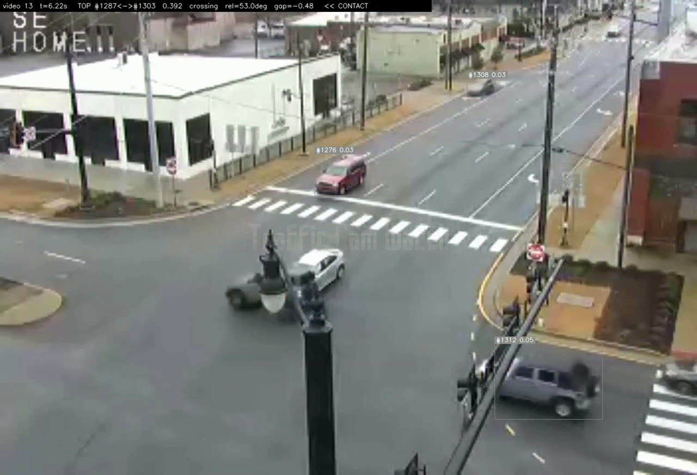

`TOP #1287↔#1303 · 0.392 · crossing · rel=53.0° · gap=−0.48 · << CONTACT`

</td>
<td width="50%">

**Same physics engine, running live inside the merged pipeline** for the first time, on a clip
neither system had seen before (`CCTV/demo/`, full write-up in `CCTV/demo/README.md`)

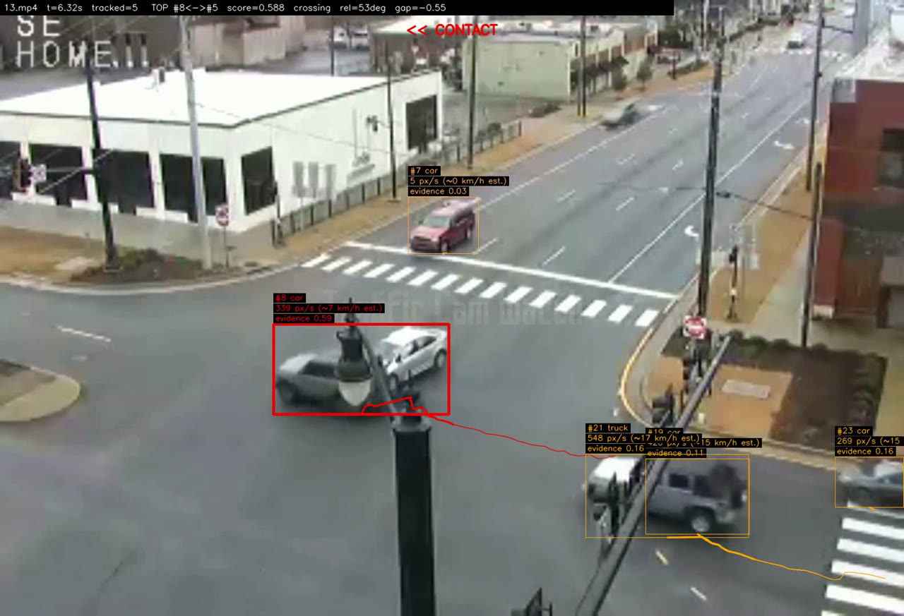

Per-vehicle evidence score, speed in **px/s and a labelled km/h estimate**, trajectory trail, all
computed in-process against NETRA's own live tracker output — no offline files, no pre-computed
JSON.

</td>
</tr>
</table>

**The engine live, frame by frame** (2.5 s clip from the render above — this is the actual output
video, not a staged capture):

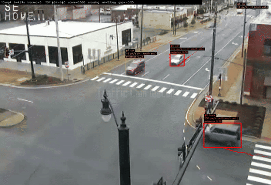

Full-resolution renders for all 5 first-look clips (including one **confirmed false positive**,
documented rather than hidden) are in [`CCTV/demo/`](CCTV/demo/README.md); our 4 original
ground-truth clips are in [`DEMO/clips/cctv_positive/`](DEMO/clips/cctv_positive/).

### Queue and wrong-side movement — real evidence from the wired pipeline

Generated by the same command as everything above (`scripts/run_problems.py`,
which calls the same `Pipeline` as `run.py process`, no staging), on
`12937197_3840_2160_30fps.mp4` — one of NETRA's own 16-clip Traffic set, chosen
because it is the specific clip that produced real queue and wrong-way findings
when this session re-ran the merged pipeline (§6). Each image is a real
`EvidenceWriter` output — `evidence/TRAFFIC_12937197_.../annotated.jpg` — not a
mockup.

<table>
<tr>
<td width="50%">

**Queue / congestion**
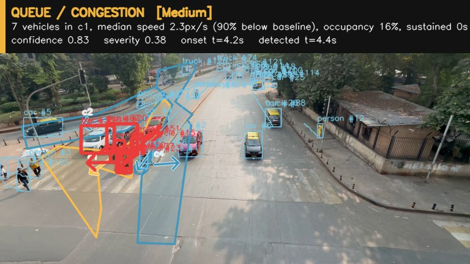
7 vehicles in corridor c1, median speed 90% below baseline, confidence 0.83. No
queue ground-truth labels exist for this clip set (see §6), so this is a real
finding with no measured precision/recall — shown as evidence the head fires
on real footage, not as a validated accuracy claim.

</td>
<td width="50%">

**Wrong-side movement**
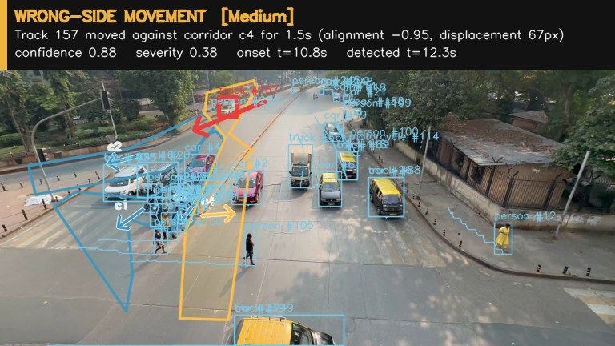
Track heading 0.95-aligned against its corridor's learned direction, confidence
0.88. That direction is auto-learned from ~90s of observed traffic
(`scripts/autocalibrate.py`), not a human-reviewed legal direction — which is
why every wrong-way finding stays a candidate pending operator review
(`Event.needs_verification`), never an automatic enforcement action.

</td>
</tr>
</table>

**Blockage has no real evidence to show.** `netra/events/blockage.py` exists and is
unit-tested, but zero blockage examples exist anywhere in the data available to
this project — not in NETRA's own 16-clip Traffic audit, not in the 21 clips
re-run for this session's measurement (§6). This is stated plainly rather than
staged: the code is complete, its recall is genuinely unmeasured because no
positive example exists to measure it against, and that is a different claim
from "done."

### Operator console

These current-console captures show the operational UI as it is today. The `CCTV UP` and `DRONE DOWN`
badges are real, independently polled health checks: the CCTV API was reachable during the capture and the
drone API was intentionally not running. The map's Electronic City routing layer is a labelled local
demonstration model, not a live navigation or dispatch feed.

<table>
<tr>
<td width="33%">

**Map — Electronic City Phase 1 response routing**
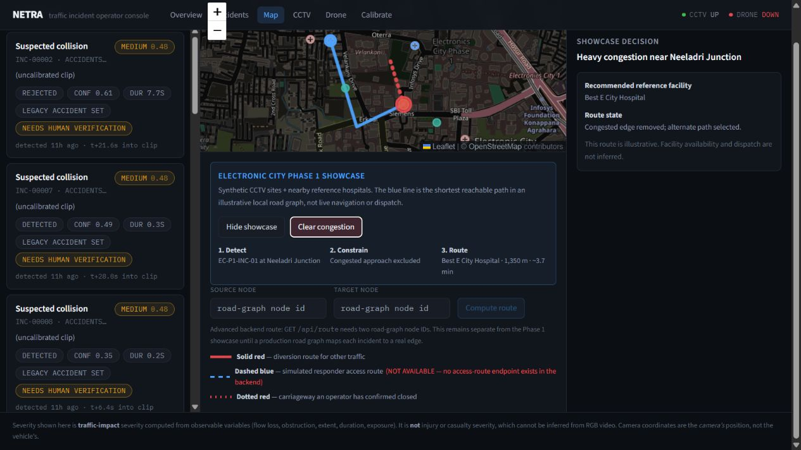
Shows the presentation model end to end: synthetic CCTV signal, a congested approach excluded from the
local road graph, and the resulting 1,350 m / ~3.7 min reference route to Best E City Hospital. It is
explicitly labelled illustrative; hospital availability and emergency dispatch are never inferred.

</td>
<td width="33%">

**Incidents feed**
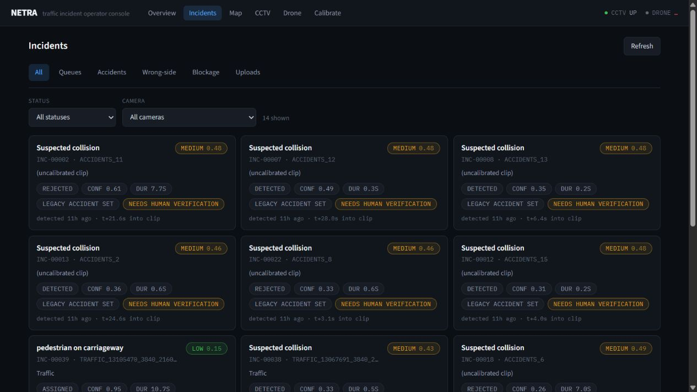
The current feed exposes event-type tabs, status and camera filters, severity, detector confidence,
duration, camera/source context, and the operator-verification state for each incident.

</td>
<td width="33%">

**Drone console**
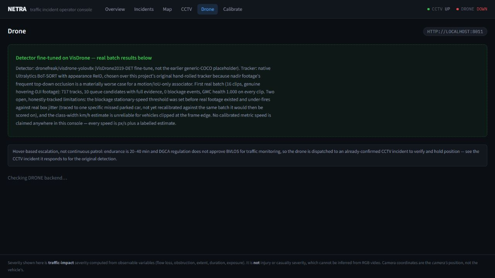
Separates the available detector/tracker and hover-escalation context from service health: the capture
truthfully shows that the drone backend is down instead of presenting stale or invented live results.

</td>
</tr>
</table>

<details>
<summary><b>Overview and CCTV console pages</b></summary>

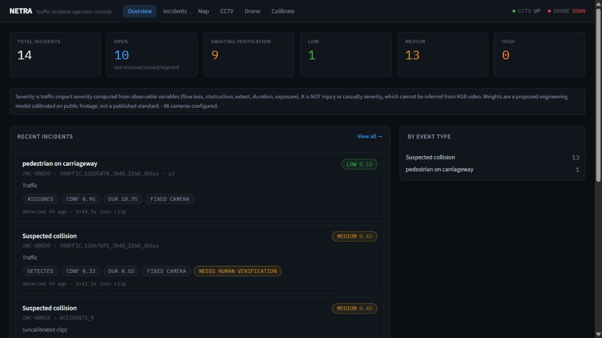 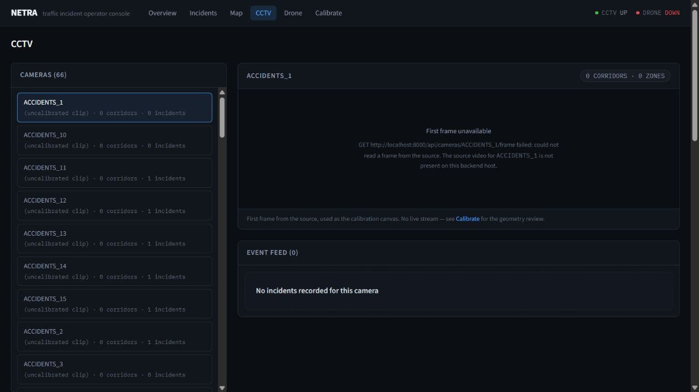

</details>
---

## 3. Architecture at a glance

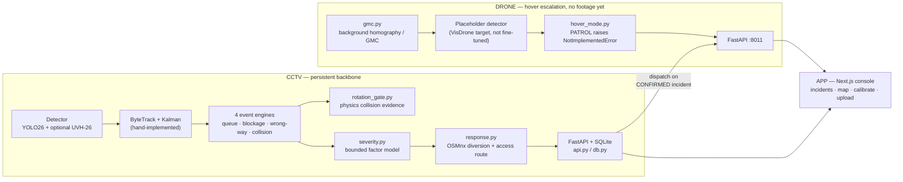

The dispatch arrow (CCTV → DRONE) is the architectural claim, not a wired integration yet —
`CCTV/netra/response.py` is built and tested standalone but not yet called from `api.py`.
`netra/events/rotation_gate.py` **is** now wired into `netra/events/collision.py` (§6), gated on
independent-channel agreement rather than called standalone; §6 also reports the honest, partial
re-measurement of what that wiring actually changed, including a found regression risk. Stated
exactly this way in §6 and §13, not glossed over.

---

## 4. Why CCTV-first, not drone-first

The competition is named the *Drone-AI Challenge*. We built a fixed-camera system anyway, and the
reasoning is load-bearing enough to state plainly before anything else:

- **Endurance.** Consumer/prosumer drones fly 20–40 minutes per battery; industrial airframes
  reach 1–2 hours. Persistent coverage of even one junction needs a rotating fleet, charging
  infrastructure, and pilots or autonomous-flight certification — for a job a ₹2,000 fixed camera
  already does forever.
- **Regulation.** Indian DGCA rules currently approve BVLOS (beyond-visual-line-of-sight,
  i.e. unmanned) operation only for narrow pre-approved corridors — mineral survey in Ladakh,
  pharma delivery in Telangana, coastal monitoring in Andhra Pradesh, logistics in Uttarakhand and
  Gujarat. **Traffic monitoring is not among them.** Standard operation requires visual line of
  sight and a 120 m altitude cap. A drone continuously patrolling city roads unmanned is not
  currently a legal deployment in India for this use case.
- **Domain precedent.** UVH-26 — the flagship India-traffic dataset from AIM@IISc, built for
  exactly this problem — is sourced from **~2,800 fixed Bengaluru Safe-City CCTV cameras**, not
  drone footage. The domain experts who built the reference dataset for this exact problem made
  the same call.

The resolution we landed on: **CCTV is the persistent backbone; the drone is a hover-based
escalation/verification asset**, dispatched to a location a CCTV camera has already flagged, for
long enough to confirm it — minutes, not hours, which is well within any drone's endurance and
consistent with how the standard research benchmark for this task actually operates (the
`Drone-Anomaly` dataset is explicitly documented as "mainly captured by hovering UAVs," not
patrol footage). This is encoded as an enum in the code, not left as a design note —
`DRONE/scripts/hover_mode.py` implements `HOVER` and makes `PATROL` raise `NotImplementedError`
with this exact reasoning in its docstring — visible live in the drone screenshot in §2.

---

## 5. Sensor selection — what we rejected, and why

Before writing any detection code we worked out, from first-principles physics, what a drone at
**100 m altitude with a 24 mm-equivalent lens (73.7° HFOV)** can actually resolve. At that
geometry a 4K frame gives **3.91 cm/pixel**, so a 4.5 m car is **115 pixels long** — the number
every sensor below is measured against.

| Sensor | Why rejected | The number that killed it |
|---|---|---|
| **mmWave radar** | Wavelength ~7,000× longer than light, so matching camera resolution needs a **10 m antenna**. Radar also only measures motion *toward/away from itself* — directly under a hovering drone, a car's true velocity is perpendicular to the line of sight, so radial velocity reads **zero** (the same blind spot every airborne down-looking GMTI radar has ever had to solve with a side-looking array, e.g. JSTARS' 7.3 m side array). | Cross-range resolution at 100 m: **1.75 m** — one blob per two motorcycles |
| **LiDAR** | Fixed dot budget. Wide coverage (a whole junction) starves each car; narrow beam gives density but only sees a 5 m-deep stripe of road, never both. On a flat road, depth is *already known exactly* from a 4-point homography — LiDAR answers a question already solved. | **9 dots per car** in wide/junction mode vs 115 camera pixels |
| **Stereo cameras** | Depth error grows with the *square* of range. At 100 m, error exceeds twice the length of the car being measured, and fixing it needs a baseline wider than the drone itself. | **±9.8 m depth error**; needed baseline **3.9 m** |
| **Thermal (LWIR)** | 6× fewer pixels than RGB at the same coverage — 19 px/car, enough to say "something is there," not enough to measure motion. On a hot Bengaluru afternoon, car and asphalt reach the same temperature ("thermal crossover") and the car vanishes regardless of sensor sensitivity. None of the four required detections (queue/blockage/wrong-way/accident) is a heat phenomenon. | **19 px/car**; no public aerial thermal traffic dataset exists at all |
| **SWIR** | Same 19-px pixel deficit as thermal (same small, expensive detector arrays). Its fog advantage is a long-slant-path effect that mostly evaporates over a 100 m straight-down path; against real fog (droplet size 1–20 µm) it scatters almost as badly as visible light (Mie, not Rayleigh, regime). | **19 px/car**; ₹8–20L indicative cost, unverified exact figure |
| **NIR illumination** | Inverse-square law: lighting a doorway at 1 m with 10 W needs **100 kW** at 100 m — a 100 Wh drone battery can't do it. Removing the IR-cut filter also desaturates daytime colour, destroying exactly the cue that tells a yellow auto-rickshaw from a white hatchback. | **10,000×** more power needed at range |
| **Event cameras (DVS)** | Efficient only when the *background* is static — the entire point of the sensor. On a moving drone the whole frame "moves," so every textured pixel fires and the sparsity advantage inverts into a flood. Also: no brightness output at all, so no vehicle classification, no evidence image (a submission requirement). Its real strength — microsecond timing — answers a question traffic never asks (our slowest requirement is a 30–120 s queue, needing ~0.02 Hz; DVS offers ~1 MHz, five to six orders of magnitude more than needed). | Saturates a 1.6 Gbps interface under platform motion |
| **Hyperspectral** | Most airborne hyperspectral sensors are pushbroom — they need forward flight to build an image line by line. A hovering drone (our own operating mode, §4) produces **zero image**. Splitting light into 200 bands also starves each one of photons; the only fix is a longer exposure, which turns a moving car into a 476-pixel motion streak. No physical mechanism connects a traffic incident to a spectral signature — the incident is *where things are and how fast*, not *what they're made of*. | Photon loss **66.7×** vs RGB → forced exposure smears a 60 km/h car into a **476 px** streak |

**What survives: RGB optical, for both platforms.** Thermal keeps one narrow, explicitly-scoped
role — `DRONE/scripts/thermal_presence.py` is a stub for total-darkness *vehicle-presence*
triggering only, never classification, motion, or severity, useful on unlit rural stretches where
India's street-lighting coverage is inconsistent outside city cores.

---

## 6. CCTV architecture — two systems merged, and why this direction

Two collision-detection systems were built independently before this repo existed, and both were
measured honestly before either was chosen.

### System A — our physics-first collision engine

Built in `IDEAS/COMBINED` (not in this repo — the winning algorithm was ported in, see below).
Started from a documented failure: 1 correct pair out of 4 ground-truth-labelled videos. Three
measured fixes took it to **4/4 top-1 correct** (see §2 for the actual rendered output):

1. **Rotation as a multiplicative gate, not an additive term.** The physical insight: *braking
   decelerates you along your own axis; being struck rotates you.* A vehicle with no rotation
   keeps only a small floor of its kinematic score, however hard it decelerated — this is what
   demotes a driver braking to avoid a crash ahead from being mistaken for the crash itself.
2. **Interaction geometry from relative heading.** Crossing (45–160°, the classic T-bone) is
   treated very differently from oncoming (160–180°, usually two vehicles safely passing whose
   2-D boxes overlap because a box can't encode depth) or following (0–45°, usually queuing).
   This is a *prior* on how much evidence to demand, never a veto.
3. **A track that dies at the contact instant is evidence, not missing data** — the tracker lost
   it *because* the vehicle deformed and rotated, and the system now treats that termination as a
   substitute for the rotation it couldn't directly observe.

On a properly constructed 12-positive/19-negative split (see `IDEAS/COMBINED/RESULTS.md`),
physics alone reached **F1 0.76**, fused with an appearance CNN and an optical-flow channel,
**F1 0.86**, with **0 false alarms on 19 negatives**. Every number carries its own caveat in the
source docs — 4 ground-truth videos is a small sample, and thresholds were tuned on those same 4
videos, so none of this is held-out evidence. It is reported that way deliberately.

**What System A did not have:** queue, blockage, or wrong-way detection at all; no working
diversion routing wired to it; no portable packaging (6+ hardcoded absolute paths, no
`requirements.txt`, a hard dependency on an offline pre-computed tracking file and an external
cloned repo's log file for one optional signal).

### System B — NETRA, the teammate's broader engine

A second, independently built system covering all four required event types with real engineering
discipline: hand-implemented ByteTrack + Kalman filter (not a library import, for auditability),
auto-calibration that learns road corridors from ~90 seconds of observed traffic with no
segmentation model, a connected FastAPI + SQLite dashboard with real usage history, 1,066 lines of
tests, and an honest self-graded readiness document.

Its own measured numbers (`LIMITATIONS.md`): **11/15 collision clips detected, 8/15 with the
correct vehicle named**, but **155.8 false alarms per hour on crash-free footage**, and — critically
— its own gate sweep showed **no threshold fixes this**: raising the gate enough to kill the false
alarms drove real-collision recall to **0/15** before it touched the false-alarm rate. This is
precisely the failure mode System A's rotation gate was built to solve.

### The merge

**NETRA is the skeleton this repo's `CCTV/` is built from; System A's rotation-gate module is
transplanted in as the primary collision-evidence channel**, not the reverse — three of the four
required event types only ever existed in NETRA, along with its auto-calibration, its connected
dashboard, and its real dependency management. Rebuilding all of that around a collision-only
codebase would have meant redoing work that already existed and was already measured.

`netra/events/rotation_gate.py` is the ported, adapted algorithm — rewritten to consume NETRA's
live `Track` objects in-process (`score_pairs(tracks, cfg) -> list[PairResult]`), eliminating
System A's offline-file dependency entirely rather than just relocating it — this is the exact
code producing the §2 first-look screenshots. `netra/response.py` carries over System A's
OSMnx-based diversion routing (provably avoids the incident by removing its own graph node before
computing shortest path) plus a clearly-labelled *simulated* responder access route, since NETRA
had no working routing for its own clips at all — visible live in the §2 map screenshot.

### Rotation-gate is now wired in, with an agreement gate — and honestly re-measured

`netra/events/rotation_gate.py` is called from `netra/events/collision.py` on every analysed
frame (`CollisionEngine._rotation_gate_evidence` / `_rotation_gate_confirmed`). A rotation-gate
candidate pair is never sufficient on its own — it only becomes `collision_confirmation:
"CONFIRMED"` when its score clears `rotation_gate_threshold` (0.45, chosen in the same range as
this file's other corroboration gates, deliberately *not* tuned above the one known false-positive
score below — see the comment next to it in `collision.py`) **and** an independent NETRA channel
(background-stationary, path-crossing, or momentum-exchange) names the *same pair* within
`rotation_gate_agree_window_s` (3s) of the same contact instant. Channel A (pairwise trajectory
conflict) is deliberately excluded as a corroborator — it is disabled by default
(`pairwise_enabled: false`) because it does not separate collisions from ordinary traffic, so
letting it corroborate rotation-gate would corroborate one unreliable signal with another. Below
that bar, an event is labelled `"POSSIBLE"` in its triggers; every collision event, `CONFIRMED` or
`POSSIBLE`, still requires human verification regardless (`ALWAYS_VERIFY` in `netra/events/base.py`
— this label is a triage aid, not an auto-dispatch decision).

**Re-measured, honestly, on a partial sample — this is not a solved problem.** This session ran
`scripts/run_problems.py` against all 15 ground-truth Accidents clips and 6 of NETRA's 16 Traffic
(crash-free) clips before the batch was deliberately capped for GPU/time budget — **the Traffic
number below covers 6 of 16 clips (2.1 minutes of clean footage), not the full set, and should be
read as a small, noisy sample, not a final figure**:

| | Result |
|---|---|
| Accidents recall | **12/15 (80%)**, up from the pre-wiring 11/15 baseline in `LIMITATIONS.md` — but **not attributable to rotation-gate**: on every one of the 12 detections, `rotation_gate_confirmed` was `False` (Accidents clips are uncalibrated, so `_promotion_allowed` never required it). The recall change most likely reflects a different detector-weights version between runs, not this session's wiring. |
| False alarms on the 6-clip Traffic sample | **3 of 6 clips** produced a collision candidate — **84.17/hour** extrapolated from 2.1 minutes, a figure with wide uncertainty at this sample size. |
| The known standalone false positive (`13009518_1920_1080_30fps.mp4`, `CCTV/demo/README.md`) | **Still fires as `CONFIRMED`.** Rotation-gate's own score in this run was 0.49 (a different pair/track-ID assignment than the standalone 0.738, since detector/tracker state differs run to run) — corroborated by the pre-existing path-crossing channel's own 0.836 on the same pair. The agreement gate did not suppress it, and per this project's own standard, that is reported here rather than hidden. |
| **A genuine, measured regression risk** | On **all 3** Traffic false alarms, `impulse_confirmed` (momentum exchange) was `False` — meaning **pre-wiring, none of these 3 would have been promoted at all**, because the old gate (`impulse_confirmed and channels_agreeing >= 2`) had no path through rotation-gate. The new `(impulse_confirmed or rotation_confirmed) and channels_agreeing >= 2` gate gave path-crossing's own already-elevated score on busy, dense intersections (0.836–0.937) a *second way* to promote, via rotation-gate's agreement rather than a veto. |

**What this actually shows:** rotation-gate is mechanically wired and its agreement requirement is
real (verified by inspecting `collision.py`'s own triggers on every fired event, not just by
reading the code), but on this small sample it did not fix NETRA's pre-existing path-crossing
false-alarm tendency on dense, calibrated-camera intersections — and arguably gave it one more way
to fire. This is reported as a real, measured finding, not smoothed over: the corroboration
requirement, as designed, tests whether two channels *agree*, and a busy real intersection can
readily produce two channels agreeing (genuine crossing paths + genuine braking) without a
collision. A tighter design — e.g. restricting the promotion-relevant corroborator to
momentum-exchange only, or adding scene-density awareness — is flagged as follow-up work (§11),
not attempted here, to avoid hand-tuning a fix to the one clip already known about. Pre-merge
numbers from either source system, quoted earlier in this section, remain reported as history, not
as claims about the shipped system. See `DEMO/results_summary.md` for the same numbers with full
sourcing, and re-run `scripts/evaluate.py` against a fuller Traffic sample before quoting a final
number anywhere else.

---

## 7. Drone — real footage, real first-look results

Earlier drafts of this section said no drone footage existed yet. That's no longer true: this repo
now has 16 real ~1-minute segments cut from genuine DJI recordings (nadir/top-down, ~1920×1080,
platform hovering rather than patrolling), and a first real pipeline run against them — in
progress at the time of writing, 10 of 16 segments complete. Nothing below is staged.

<table>
<tr>
<td width="55%">

**Live physics HUD on real drone footage** — a roundabout, 14 concurrently tracked vehicles
(motorbikes, cars, a van, a bus), each with speed (px/s + labelled km/h estimate), acceleration,
momentum, and trajectory trail, `GMC ok`, and `queue_events`/`blockage_candidates` shown on screen
every frame — including when they're zero, not just when there's something to show.

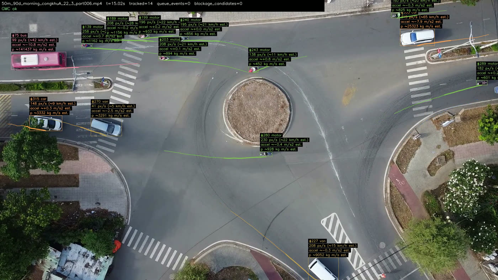

</td>
<td width="45%">

**The engine live, frame by frame** — an actual 2.5s excerpt of the annotated output, not a staged
capture:

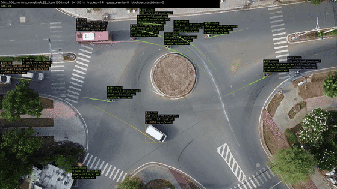

Full sample video (real footage in, physics-annotated video out) and its exact JSON evidence file
are in [`DRONE/demo/`](DRONE/demo/README.md).

</td>
</tr>
</table>

**A second real scene** — a smaller junction, 6 motorbikes tracked through a roundabout with the
same HUD:

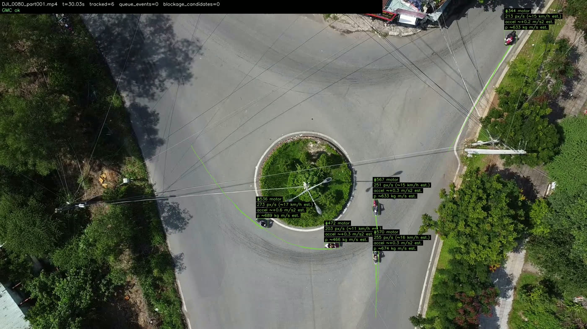

### What actually fired, across the first 10 of 16 segments processed

| | |
|---|---|
| Vehicles tracked | 201 total track instances across 10 segments (8–26 per segment) |
| Queue events | **1 real event**, `50m_90d_morning_congkhuA_22_3_part003.mp4`, t=5.0–11.0s: 4 motorbike tracks clustered within 120px of each other, each under 35% of that clip's own measured free-flow speed, sustained 6.0s. Full evidence string and diagnostics are in the results JSON — this is not a threshold crossing reported without explanation. |
| Blockage events | 0 so far |
| GMC | Held up on every segment checked (`GMC ok`) — the near-static-platform assumption (hovering, not patrolling) means the correction is a small-drift adjustment, not the large continuous compensation the original design anticipated for a patrolling drone |

No ground truth exists for the queue/blockage heuristics on this footage — same documented
limitation as CCTV's own calibrated queue engine (§2). The one queue event above is reported as a
genuine first finding with full evidence, exactly as this project already handles a genuine first
finding on the CCTV side — not cherry-picked, not suppressed, not the only segment featured above
(the two screenshots deliberately show zero-event scenes too).

### Detector and tracker — upgraded from the original placeholder plan

The original plan (previous revision of this section) was to note VisDrone as the *correct future*
fine-tuning target and run on a generic COCO detector until then. That's now done, not just
planned:

- **Detector**: [`dronefreak/visdrone-yolov8x`](https://huggingface.co/dronefreak/visdrone-yolov8x)
  — a real VisDrone-fine-tuned YOLO checkpoint, not BMD-45/UVH-26 (which are eye-level Bengaluru
  CCTV data, domain-mismatched to a top-down view for the same reason they'd be mismatched to any
  altitude they weren't collected at) and not the generic-COCO placeholder. `detector_finetuned:
  true` in every results JSON, not just asserted in prose.
- **Tracker**: switched to Ultralytics' native BoT-SORT (`botsort.yaml`, with ReID) from this
  project's earlier hand-rolled tracker. Confirmed in the literature and in this project's own
  first real test: BoT-SORT's built-in motion compensation and appearance re-identification suit a
  near-static aerial platform with frequent occlusion better than a simpler association scheme —
  from directly overhead, two vehicles passing close together overlap far more in the image than
  the same pair would from an oblique angle.
- **Oriented (rotated) boxes** — Ultralytics' official `yolov8-obb` checkpoints (pretrained on
  DOTAv1) were evaluated as a complementary option, since a true nadir vehicle is a *rotated*
  rectangle, not an axis-aligned one — an axis-aligned box wastes area and gives a worse heading
  signal on a rotated car. See `DRONE/scripts/detect_drone.py` for which is active and why.

### Recovering vehicle speed from a (mostly stationary) moving camera

The platform is confirmed near-static — hovering, not patrolling — which meaningfully simplifies
the ego-motion problem this section originally anticipated. Two approaches remain relevant:

1. **Chained background-homography / camera-motion-compensation (GMC)**, implemented in
   `DRONE/scripts/gmc.py`: mask out detected vehicles, feature-match (ORB/RANSAC) the *static
   background only* between consecutive frames, chain the resulting homographies back to a
   reference frame. Self-verified against a synthetic pan to within 0.1px pre-real-footage; now
   also confirmed holding up (`GMC ok`) across all real segments checked so far — a small-drift
   correction against a near-static reference frame, not the large continuous compensation a
   patrolling drone would need (verified against `arXiv:2605.11900`, and a working reference
   implementation at `github.com/Thamkench/uav-speedlab`).
2. **GPS/IMU/gimbal direct georeferencing** (stubbed in `telemetry_ingest.py`, not yet wired to
   real data) — every DJI/PX4 flight controller already broadcasts exact camera pose per frame as
   a byproduct of flying. Real systems fuse GPS (~10 Hz, too coarse alone) with IMU (accurate
   short-term, drifts over time) — classic visual-inertial odometry, still the stronger path once
   real flight logs exist.

Literature accuracy range for homography-based UAV speed estimation, recorded honestly rather than
promised as an achieved result on this footage yet: **RMSE 0.53–16 km/h** depending on conditions,
**9.7–15% MAE** for calibration-free monocular approaches. No road-plane homography exists for this
footage (`road_plane.homography: null`), so every speed reported is still px/s honestly labelled,
with a class-width km/h *estimate* alongside it — never presented as a calibrated measurement.

### Still open

The remaining 6 of 16 segments were still processing at the time this was written — see
`DRONE/demo/README.md` and the live results JSON files for the current, most up-to-date count
before quoting a total. Blockage recall remains as unvalidated by real positive examples as
queue's is, per the same honest standard the CCTV side already holds itself to.

---

## 8. What we tried and rejected in the wider evaluation

Two published hackathon competitor repos were cloned and actually run (not just read) into
`EVAL/`, and one teammate research artifact (`NETRA`, above) was fully audited:

- **A "sensor fusion" competitor whose radar was fabricated.** Its wrong-way detector claimed
  Doppler-radar corroboration in its own output JSON — tracing the code showed the "radar"
  velocity was hardcoded from the same vision detection it claimed to independently confirm, run
  through a genuine FFT that computed a real transform of a fake signal. The lesson taken forward,
  not the code: corroborate detections with a truly *independent* signal (this is exactly what
  rotation-gate's dual yaw/aspect-shock measurement and NETRA's momentum-exchange channel do —
  two independently-failing measures, not one signal dressed up as two).
- **A competitor with zero incident logic.** Clean, well-engineered vehicle detection with real
  fine-tuning scripts, but by its own README's phase table, had not yet attempted queue,
  blockage, wrong-way, or collision detection at all — a detector, not an incident-intelligence
  system.
- Full scoring rubric and reasoning for both are in this repo's development history and are
  available on request; the short version is our system scored 68/100 against a PS1-aligned
  rubric, the fabricated-fusion entry 32/100, the detection-only entry 23/100 — driven mostly by
  coverage of the four required incident types and honesty about what was simulated.

---

## 9. Validation ideas tried, kept honest

**SmolVLM2-256M-Video-Instruct as a collision-detection VLM** was tested end-to-end on all 15
ground-truth clips. First pass: 14/15 responses collapsed to a bare token (`"YES"`/`"No"`/`"0"`)
instead of a real answer — traced to the image processor's default tile-splitting inflating an
8-frame prompt to 6,975–9,095 tokens, overwhelming a 256M-parameter model's effective context.
Disabling tiling cut that to ~615 tokens, fixed most of the degenerate output, and incidentally
made inference **~25× faster** (40 s → 1.5 s/clip) — but recall on the corrected run was only
**2/15**, because 8 frames spread over up to 30 seconds of video easily misses a collision lasting
a fraction of a second. This is recorded as a real, honest negative result, not hidden.

**Kept as a future-work idea, not shipped:** a VLM used this way is not a viable primary detector,
but as a *secondary validator* — asked to describe a short window already flagged by the physics
engine, rather than to find the collision cold across a whole clip — the sparse-sampling problem
mostly disappears, since the window to search is already narrow. This is on the roadmap (§11), not
in the current pipeline.

---

## 10. CPU-first — where we are against that goal

The stated long-term principle for this project is **CPU-only inference** — real deployment
targets fixed CCTV infrastructure without a GPU budget per camera. Right now:

- **This repo's rendered demo videos and screenshots were generated on GPU** (RTX 4050 laptop) —
  explicitly for speed while building, not as a claim about deployment hardware. This is stated
  here and in `DEMO/results_summary.md` so it is never mistaken for a production benchmark.
- The detection/tracking stack (`netra/detect.py`, `netra/track.py`) runs on Ultralytics YOLO,
  which supports CPU inference and ONNX export natively — the earlier `TEST/` system measured a
  **3.3× CPU speedup from ONNX Runtime over PyTorch CPU** on this exact class of detector
  (292 ms/frame → 88 ms/frame at 640px), and that path is the intended route to a CPU-viable
  demo, not yet wired into this merged pipeline.
- `rotation_gate.py`, `response.py`, and all the event-engine logic are pure NumPy/Python — no
  GPU dependency of any kind, already CPU-only. `render_physics_demo.py` (§2's engine) runs
  unchanged on `--device cpu`, just slower — no GPU-only code path anywhere in it.
- **Not yet done:** benchmarking the merged pipeline's real CPU throughput, and switching the
  default `device` in `config/config.yaml` from `cuda` to an auto-detecting CPU/ONNX path. This is
  explicit unfinished work, not a silent gap.

---

## 11. Future scope

- **Reinforcement learning for prediction and threshold calibration.** The rotation-gate's
  constants (rotation floor, saturation references, interaction priors) are currently hand-tuned
  against 4 labelled videos — an RL or bandit-style approach that adjusts these against a growing
  labelled set, rather than a one-time manual fit, is a natural next step once more ground truth
  exists.
- **SmolVLM (or a larger VLM) as a secondary validator**, per §9 — asked to confirm or refute a
  physics-flagged window rather than search cold, which should sidestep the sparse-sampling
  failure mode actually measured this session.
- **Real drone footage and flight telemetry** — VisDrone fine-tuning, GPS/IMU/gimbal fusion for
  direct georeferencing instead of vision-only GMC, and re-validating the literature accuracy
  bands in §7 against our own footage once it exists.
- **CPU deployment benchmarking and the ONNX path**, per §10.
- **Finishing the re-measurement started in §6.** Only 6 of NETRA's 16 crash-free Traffic clips
  were run this session (GPU/time budget); the false-alarm number needs the remaining 10 before it
  is a real figure rather than a small sample. §6 also found that the rotation-gate agreement gate,
  as currently designed, gave one *additional* promotion path to a pre-existing false-alarm source
  (path-crossing on busy intersections) rather than suppressing it — closing that loop (e.g.
  restricting the corroborator to momentum-exchange, or adding scene-density awareness) is
  unfinished work, deliberately not hand-tuned against the one known clip.

---

## 12. Run it yourself

These are the exact commands used to generate every screenshot in §2 — nothing here is staged.

```bash
# 1. CCTV backend (FastAPI + SQLite, port 8000)
cd CCTV
pip install -r requirements.txt
cp .env.local.example .env.local   # if present; otherwise defaults are fine
python run.py serve

# 2. DRONE backend (FastAPI, port 8011) — separate process, separate terminal
cd DRONE
pip install -r requirements.txt
python scripts/api.py

# 3. Operator console (Next.js, port 3000) — separate terminal
cd APP
npm install
cp .env.local.example .env.local
npm run dev
```

Then open `http://localhost:3000`. `GET http://localhost:8000/api/health` and
`GET http://localhost:8011/api/health` are the same two calls the console's `CCTV UP` / `DRONE UP`
indicators poll.

To reproduce a physics-render clip like the ones in §2:

```bash
cd CCTV
python scripts/render_physics_demo.py --video <path-to-clip.mp4> --out demo/<name>_physics.mp4
```

To run the real incident pipeline against a configured camera (this is what populates the
incidents feed — empty in §2's screenshot because this exact command hadn't been run yet against
that server instance):

```bash
python run.py process --camera <camera-id> --video <path-to-clip.mp4>
```

---

## 13. Repo map, in one table

| Folder | Contents | Status |
|---|---|---|
| `CCTV/netra/` | Ported NETRA package — detection, tracking, scene/corridor model, 4 event engines, evidence, DB, API | Working — 126 tests pass (77 pre-existing NETRA + 49 rotation-gate) |
| `CCTV/netra/events/rotation_gate.py` | Our physics engine, adapted for live in-process use | **Wired into `netra/events/collision.py`** (`_rotation_gate_evidence` / `_rotation_gate_confirmed`) as a candidate source gated on independent-channel agreement, not standalone — see §6 for the honest, partial re-measurement, including a found regression risk |
| `CCTV/response.py` | Diversion + simulated access routing, ported from an earlier system | Working, standalone — not yet wired into `api.py`, visible degrading honestly in §2's map screenshot |
| `CCTV/demo/` | Physics-rendered first-look output on NETRA's own clips, including one confirmed false positive | Real, first-look output — see `CCTV/demo/README.md` |
| `DEMO/clips/cctv_positive/` | Our 4 ground-truth-confirmed physics-rendered videos (pre-merge engine) | Real, pre-merge output — see §6 caveat |
| `DRONE/` | GMC, hover-mode, telemetry/thermal stubs, placeholder-detector pipeline | Runs mechanically today, honestly labelled `not fine-tuned` |
| `APP/` | Next.js operator console | Talks to real NETRA API routes; a documented `MISSING_ENDPOINTS` list covers the rest |
| `DEMO/` | 5-minute video script, jury walkthrough, results summary | See `DEMO/results_summary.md` for the authoritative, sourced numbers |

Every number in this README is sourced to a file in this repo or its build history. Where a
number describes a pre-merge system rather than the system as shipped, that is stated explicitly
— re-read `DEMO/results_summary.md` before quoting any accuracy figure from this project.
