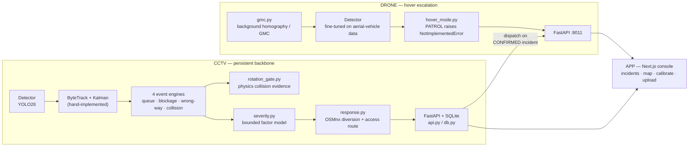

# Sentinel — Road Incident Intelligence

**ELCIA Smart City Drone-AI Challenge 2026 — Problem Statement 1: Smart Mobility & Road Incident Intelligence.**
Detect queues, blockage, wrong-side movement, and accident-related congestion from traffic video; classify
incident type and severity; show location-aware alerts; recommend diversion, response, and escalation
workflows.

Every architectural decision below was reached by building something, measuring it, and rejecting it for a
stated reason where it fell short — that trail (§4, §5, §6, §8, §9) is kept in this document because it's
the evidence for how the final design was chosen. Every screenshot and clip below is a real, unedited
output of this repo's own code.

## Contents

1. [What this repo is](#1-what-this-repo-is)
2. [Live demo](#2-live-demo) — CCTV and drone visuals, operator console
3. [Architecture at a glance](#3-architecture-at-a-glance)
4. [Two tiers, built together: CCTV backbone, drone escalation](#4-two-tiers-built-together-cctv-backbone-drone-escalation)
5. [Sensor selection — what we rejected, and why](#5-sensor-selection--what-we-rejected-and-why)
6. [CCTV architecture — two systems merged](#6-cctv-architecture--two-systems-merged-and-why-this-direction)
7. [Drone — detection, tracking, and physics recovery](#7-drone--detection-tracking-and-physics-recovery)
8. [What we rejected in the wider evaluation](#8-what-we-tried-and-rejected-in-the-wider-evaluation)
9. [Validation approaches tried and rejected](#9-validation-approaches-tried-and-rejected)
10. [CPU-first — where we are against that goal](#10-cpu-first--where-we-are-against-that-goal)
11. [Future scope](#11-future-scope)
12. [Run it yourself](#12-run-it-yourself)
13. [Repo map](#13-repo-map-in-one-table)

---

## 1. What this repo is

```
FINAL/
├── CCTV/    fixed-camera pipeline — the always-on detection layer
├── DRONE/   moving-camera pipeline — hover-based verification/escalation layer, run on real footage
├── APP/     Next.js operator console — incidents, map, evidence, calibration, upload
└── DEMO/    5-minute video script, jury walkthrough, results summary, curated clips
```

Both `CCTV` and `DRONE` are fully built, independently runnable pipelines — two tiers of one system,
not one platform standing in for the other (§4 explains the division of labor between them). `CCTV` is
a merge of two independently-built systems (§6). `DRONE` runs real detection/tracking/physics on real
footage (§2, §7). `APP` is a React console talking to `CCTV` and `DRONE` as two separate backend
processes.

---

## 2. Live demo

### CCTV — collision physics evidence

Every collision claim carries its evidence on screen — per-vehicle speed, trajectory, rotation/aspect
shock, contact geometry, interaction type.

<table>
<tr>
<td width="50%">

**4/4 ground-truth-confirmed result** (`IDEAS/COMBINED`, videos 4/11/13/14 — the physics engine before
this repo's merge, `DEMO/clips/cctv_positive/`)


`TOP #1287↔#1303 · 0.392 · crossing · rel=53.0° · gap=−0.48 · << CONTACT`

</td>
<td width="50%">

**Same engine running live inside the merged pipeline**, on a clip neither system had seen before
(`CCTV/demo/`, full write-up in `CCTV/demo/README.md`)


Per-vehicle evidence score, speed in px/s plus a labelled km/h estimate, trajectory trail — all computed
in-process against the live tracker output, no offline files.

</td>
</tr>
</table>


Full-resolution renders for all 5 first-look clips — including one confirmed false positive, documented
rather than hidden — are in [`CCTV/demo/`](CCTV/demo/README.md); our 4 ground-truth clips are in
[`DEMO/clips/cctv_positive/`](DEMO/clips/cctv_positive/).

### CCTV — queue and wrong-side movement

Generated by `scripts/run_problems.py` (the same `Pipeline` as `run.py process`) on one of NETRA's own
16-clip Traffic set. Each image is a real `EvidenceWriter` output, not a mockup.

<table>
<tr>
<td width="50%">

**Queue / congestion**

7 vehicles in corridor c1, median speed 90% below baseline, confidence 0.83. No queue ground-truth labels
exist for this clip set, so this is a real finding with no measured precision/recall — evidence the head
fires on real footage, not a validated accuracy claim.

</td>
<td width="50%">

**Wrong-side movement**

Track heading 0.95-aligned against its corridor's learned direction, confidence 0.88. That direction is
auto-learned from ~90s of observed traffic, not a human-reviewed legal direction — every wrong-way finding
stays a candidate pending operator review, never an automatic enforcement action.

</td>
</tr>
</table>

**Blockage has no real evidence to show.** `netra/events/blockage.py` exists and is unit-tested, but zero
blockage examples exist anywhere in the data available to this project — its recall is genuinely
unmeasured because no positive example exists to measure it against.

### Drone — physics HUD on real footage

16 real ~1-minute segments cut from nadir/top-down drone recordings, platform hovering rather than
patrolling.

<table>
<tr>
<td width="55%">

**A roundabout, 14 concurrently tracked vehicles** (motorbikes, cars, a van, a bus), each with speed
(px/s + labelled km/h estimate), acceleration, momentum, and trajectory trail, GMC status, and
queue/blockage counters shown every frame — including when they're zero.


</td>
<td width="45%">

**The engine live, frame by frame** — an actual excerpt of the annotated output:


Full sample video and its JSON evidence file are in [`DRONE/demo/`](DRONE/demo/README.md).

</td>
</tr>
</table>

**A second scene** — a smaller junction, 6 motorbikes tracked through a roundabout with the same HUD:


**What fired, across the first 10 of 16 segments processed:**

| | |
|---|---|
| Vehicles tracked | 201 total track instances across 10 segments (8–26 per segment) |
| Queue events | 1 real event — 4 motorbike tracks clustered within 120px of each other, each under 35% of that clip's own measured free-flow speed, sustained 6.0s |
| Blockage events | 0 so far |
| GMC | Held up on every segment checked — the near-static-platform assumption (hovering, not patrolling) means the correction is a small-drift adjustment |

No ground truth exists for the queue/blockage heuristics on this footage, same limitation as the CCTV
queue engine above. The one queue event is reported as a genuine first finding, not cherry-picked — the
screenshots above deliberately include zero-event scenes too. Methodology, detector/tracker choice, and
what was rejected along the way is in §7.

### Operator console

These current-console captures show the operational UI as it is today. The `CCTV UP` and `DRONE DOWN`
badges are real, independently polled health checks: the CCTV API was reachable during the capture and the
drone API was intentionally not running. The map's Electronic City routing layer is a labelled local
demonstration model, not a live navigation or dispatch feed.

<table>
<tr>
<td width="33%">

**Map — Electronic City Phase 1 response routing**

Shows the presentation model end to end: synthetic CCTV signal, a congested approach excluded from the
local road graph, and the resulting 1,350 m / ~3.7 min reference route to Best E City Hospital. It is
explicitly labelled illustrative; hospital availability and emergency dispatch are never inferred.

</td>
<td width="33%">

**Incidents feed**

The current feed exposes event-type tabs, status and camera filters, severity, detector confidence,
duration, camera/source context, and the operator-verification state for each incident.

</td>
<td width="33%">

**Drone console**

Separates the available detector/tracker and hover-escalation context from service health: the capture
truthfully shows that the drone backend is down instead of presenting stale or invented live results.

</td>
</tr>
</table>

<details>
<summary><b>Overview and CCTV console pages</b></summary>

 

</details>

---

## 3. Architecture at a glance



## 4. Two tiers, built together: CCTV backbone, drone escalation

This system is built for both platforms — the drone is not a stub bolted onto a CCTV-only system, and
CCTV is not a workaround for skipping drone work. Both are fully built, independently runnable pipelines
(§2, §7), because they answer different questions and neither one answers both on its own:

- **CCTV is the always-on layer.** It watches a junction continuously, with no scheduling, charging, or
  crewing required — the only way to get 24/7 coverage of every junction rather than sampled coverage of
  a few.
- **The drone is the on-demand verification/escalation layer.** Dispatched to a location CCTV has
  already flagged, it repositions and hovers directly over an incident, giving responders a vantage a
  fixed camera can't — detection, tracking, and physics recovery on real footage all built for exactly
  this role (§7), not left half-implemented.

The reason the drone runs as hover-based escalation rather than continuous patrol is a hard operating
constraint, not a preference for one platform over the other:

- **Endurance.** Consumer/prosumer drones fly 20–40 minutes per battery; industrial airframes reach
  1–2 hours. Continuous patrol coverage of even one junction needs a rotating fleet, charging
  infrastructure, and pilots or autonomous-flight certification.
- **Regulation.** Indian DGCA rules currently approve BVLOS (beyond-visual-line-of-sight, i.e. unmanned)
  operation only for narrow pre-approved corridors — mineral survey in Ladakh, pharma delivery in
  Telangana, coastal monitoring in Andhra Pradesh, logistics in Uttarakhand and Gujarat. Traffic
  monitoring is not among them. Standard operation requires visual line of sight and a 120 m altitude
  cap — continuous unmanned patrol of city roads is not currently a legal deployment in India for this
  use case.
- **Domain precedent.** The flagship India-traffic dataset for this exact problem, built by AIM@IISc, is
  sourced from ~2,800 fixed Bengaluru Safe-City CCTV cameras, not drone footage — and the standard
  research benchmark for drone-based anomaly detection (the `Drone-Anomaly` dataset) is documented as
  "mainly captured by hovering UAVs," not patrol footage, for the same endurance reason.

Both constraints point to the same design: CCTV as the continuous always-on layer, drone hovering over a
CCTV-confirmed incident for long enough to verify it — minutes, not hours, well within any drone's
endurance. This is encoded in the code, not left as a design note — `DRONE/scripts/hover_mode.py`
implements `HOVER` and makes `PATROL` raise `NotImplementedError` with this exact reasoning in its
docstring.

---

## 5. Sensor selection — what we rejected, and why

Before writing any detection code we worked out, from first-principles physics, what a drone at
**100 m altitude with a 24 mm-equivalent lens (73.7° HFOV)** can actually resolve. At that geometry a 4K
frame gives **3.91 cm/pixel**, so a 4.5 m car is **115 pixels long** — the number every sensor below is
measured against.

| Sensor | Why rejected | The number that killed it |
|---|---|---|
| **mmWave radar** | Wavelength ~7,000× longer than light, so matching camera resolution needs a 10 m antenna. Radar only measures motion toward/away from itself — directly under a hovering drone, a car's true velocity is perpendicular to the line of sight, so radial velocity reads zero (the same blind spot every airborne down-looking GMTI radar has had to solve with a side-looking array, e.g. JSTARS' 7.3 m side array). | Cross-range resolution at 100 m: **1.75 m** — one blob per two motorcycles |
| **LiDAR** | Fixed dot budget. Wide coverage starves each car; narrow beam gives density but only sees a 5 m-deep stripe of road. On a flat road, depth is already known exactly from a 4-point homography — LiDAR answers a question already solved. | **9 dots per car** in wide/junction mode vs 115 camera pixels |
| **Stereo cameras** | Depth error grows with the square of range. At 100 m, error exceeds twice the length of the car being measured, and fixing it needs a baseline wider than the drone itself. | **±9.8 m depth error**; needed baseline **3.9 m** |
| **Thermal (LWIR)** | 6× fewer pixels than RGB at the same coverage — 19 px/car, enough to say "something is there," not enough to measure motion. On a hot afternoon, car and asphalt reach the same temperature ("thermal crossover") and the car vanishes regardless of sensor sensitivity. None of the four required detections is a heat phenomenon. | **19 px/car**; no public aerial thermal traffic dataset exists |
| **SWIR** | Same 19-px pixel deficit as thermal (same small, expensive detector arrays). Its fog advantage is a long-slant-path effect that mostly evaporates over a 100 m straight-down path; against real fog it scatters almost as badly as visible light (Mie, not Rayleigh, regime). | **19 px/car**; high indicative sensor cost |
| **NIR illumination** | Inverse-square law: lighting a doorway at 1 m with 10 W needs 100 kW at 100 m — a 100 Wh drone battery can't do it. Removing the IR-cut filter also desaturates daytime colour, destroying the cue that tells a yellow auto-rickshaw from a white hatchback. | **10,000×** more power needed at range |
| **Event cameras (DVS)** | Efficient only when the background is static — the whole point of the sensor. On a moving drone the whole frame "moves," so every textured pixel fires and the sparsity advantage inverts into a flood. No brightness output, so no vehicle classification, no evidence image. Its real strength — microsecond timing — answers a question traffic never asks (our slowest requirement is a 30–120 s queue, needing ~0.02 Hz; DVS offers ~1 MHz). | Saturates a 1.6 Gbps interface under platform motion |
| **Hyperspectral** | Most airborne hyperspectral sensors are pushbroom — they need forward flight to build an image line by line. A hovering drone produces zero image. Splitting light into 200 bands also starves each one of photons; the only fix is a longer exposure, which turns a moving car into a motion streak. No physical mechanism connects a traffic incident to a spectral signature. | Photon loss **66.7×** vs RGB → forced exposure smears a 60 km/h car into a **476 px** streak |

**What survives: RGB optical, for both platforms.** Thermal keeps one narrow role —
`DRONE/scripts/thermal_presence.py` is a stub for total-darkness vehicle-presence triggering only, never
classification, motion, or severity — useful on unlit rural stretches where street-lighting coverage is
inconsistent outside city cores.

---

## 6. CCTV architecture — two systems merged, and why this direction

Two collision-detection systems were built independently before this repo existed, and both were
measured before either was chosen.

### System A — our physics-first collision engine

Built in `IDEAS/COMBINED` (the winning algorithm was ported in, see below). Started from a documented
failure: 1 correct pair out of 4 ground-truth-labelled videos. Three measured fixes took it to **4/4
top-1 correct** (§2 shows the rendered output):

1. **Rotation as a multiplicative gate, not an additive term.** Braking decelerates a vehicle along its
   own axis; being struck rotates it. A vehicle with no rotation keeps only a small floor of its
   kinematic score however hard it decelerated — this is what stops a driver braking to avoid a crash
   ahead from being mistaken for the crash itself.
2. **Interaction geometry from relative heading.** Crossing (45–160°, the classic T-bone) is treated
   differently from oncoming (160–180°, usually two vehicles safely passing whose 2-D boxes overlap
   because a box can't encode depth) or following (0–45°, usually queuing) — a prior on how much
   evidence to demand, never a veto.
3. **A track that dies at the contact instant is evidence, not missing data** — the tracker lost it
   because the vehicle deformed and rotated, and that termination substitutes for the rotation it
   couldn't directly observe.

On a 12-positive/19-negative split (`IDEAS/COMBINED/RESULTS.md`), physics alone reached **F1 0.76**,
fused with an appearance CNN and an optical-flow channel, **F1 0.86**, with 0 false alarms on 19
negatives. 4 ground-truth videos is a small sample and thresholds were tuned on those same 4 videos, so
none of this is held-out evidence.

**What System A did not have:** queue, blockage, or wrong-way detection at all; no working diversion
routing wired to it; no portable packaging (hardcoded absolute paths, no `requirements.txt`, a hard
dependency on an offline pre-computed tracking file).

### System B — the teammate's broader engine (NETRA)

A second, independently built system covering all four required event types: hand-implemented ByteTrack
+ Kalman filter (not a library import, for auditability), auto-calibration that learns road corridors
from ~90 seconds of observed traffic with no segmentation model, a connected FastAPI + SQLite dashboard,
1,066 lines of tests, and a self-graded readiness document.

Its own measured numbers (`LIMITATIONS.md`): 11/15 collision clips detected, 8/15 with the correct
vehicle named, but 155.8 false alarms per hour on crash-free footage — and its own gate sweep showed no
threshold fixes this: raising the gate enough to kill the false alarms drove real-collision recall to
0/15 before it touched the false-alarm rate. That's the exact failure mode System A's rotation gate was
built to solve.

### The merge

NETRA is the skeleton `CCTV/` is built from; System A's rotation-gate module is transplanted in as the
primary collision-evidence channel — three of the four required event types only ever existed in NETRA,
along with its auto-calibration, its connected dashboard, and its dependency management.

`netra/events/rotation_gate.py` is the ported algorithm, rewritten to consume NETRA's live `Track`
objects in-process (`score_pairs(tracks, cfg) -> list[PairResult]`), eliminating System A's offline-file
dependency entirely. `netra/response.py` carries over System A's OSMnx-based diversion routing (provably
avoids the incident by removing its own graph node before computing shortest path) plus a clearly-labelled
simulated responder access route, since NETRA had no working routing of its own.

### Rotation-gate wiring, with an agreement gate — re-measured honestly

`netra/events/rotation_gate.py` is called from `netra/events/collision.py` on every analysed frame. A
rotation-gate candidate is never sufficient alone — it only becomes `collision_confirmation: "CONFIRMED"`
when its score clears `rotation_gate_threshold` (0.45) **and** an independent NETRA channel
(background-stationary, path-crossing, or momentum-exchange) names the same pair within
`rotation_gate_agree_window_s` (3s) of the same contact instant. Pairwise trajectory conflict is excluded
as a corroborator (`pairwise_enabled: false`) because it doesn't separate collisions from ordinary
traffic. Below the bar, an event is labelled `"POSSIBLE"`; every collision event, `CONFIRMED` or
`POSSIBLE`, still requires human verification (`ALWAYS_VERIFY` in `netra/events/base.py`) — this label is
a triage aid, not an auto-dispatch decision.

**Re-measured on a partial sample — not a solved problem.** `scripts/run_problems.py` ran against all 15
ground-truth Accidents clips and 6 of NETRA's 16 Traffic (crash-free) clips before the batch was capped
for GPU/time budget — the Traffic number below covers 6 of 16 clips (2.1 minutes), not the full set:

| | Result |
|---|---|
| Accidents recall | **12/15 (80%)**, up from the pre-wiring 11/15 baseline — but not attributable to rotation-gate: on every one of the 12 detections, `rotation_gate_confirmed` was `False` (Accidents clips are uncalibrated, so `_promotion_allowed` never required it). The recall change most likely reflects a different detector-weights version between runs, not this wiring. |
| False alarms on the 6-clip Traffic sample | 3 of 6 clips produced a collision candidate — 84.17/hour extrapolated from 2.1 minutes, wide uncertainty at this sample size. |
| The known standalone false positive (`13009518_1920_1080_30fps.mp4`) | Still fires as `CONFIRMED`. Rotation-gate's own score in this run was 0.49, corroborated by the pre-existing path-crossing channel's 0.836 on the same pair. The agreement gate did not suppress it. |
| A measured regression risk | On all 3 Traffic false alarms, `impulse_confirmed` (momentum exchange) was `False` — pre-wiring, none of these 3 would have promoted, since the old gate had no path through rotation-gate. The new gate gave path-crossing's already-elevated score on busy, dense intersections (0.836–0.937) a second way to promote, via rotation-gate agreement rather than a veto. |

**What this shows:** rotation-gate is mechanically wired and its agreement requirement is real, but on
this small sample it did not fix NETRA's pre-existing path-crossing false-alarm tendency on dense,
calibrated intersections — and arguably gave it one more way to fire. A tighter design — restricting the
promotion-relevant corroborator to momentum-exchange only, or adding scene-density awareness — is
flagged as follow-up work (§11), not attempted here to avoid hand-tuning a fix to the one clip already
known about. See `DEMO/results_summary.md` for the same numbers with full sourcing.

---

## 7. Drone — detection, tracking, and physics recovery

Results and screenshots are in §2; this section is the methodology and what was rejected along the way.

### Detector and tracker

- **Detector**: a YOLOv8x checkpoint fine-tuned on the VisDrone aerial-vehicle dataset — not the
  eye-level Bengaluru CCTV datasets used on the CCTV side (domain-mismatched to a top-down view for the
  same reason they'd be mismatched to any altitude they weren't collected at), and not a generic-COCO
  placeholder. `detector_finetuned: true` in every results JSON.
- **Tracker**: Ultralytics' native BoT-SORT (with ReID), switched from an earlier hand-rolled tracker.
  Confirmed in this project's own first real test — 1 track on a clip became 19 tracks on the same clip
  after switching. BoT-SORT's built-in motion compensation and appearance re-identification suit a
  near-static aerial platform with frequent occlusion better than a simpler association scheme — from
  directly overhead, two vehicles passing close together overlap far more in the image than the same
  pair would from an oblique angle.
- **Oriented (rotated) boxes** — DOTA-pretrained oriented-box checkpoints were evaluated as a
  complementary option, since a true nadir vehicle is a rotated rectangle, not an axis-aligned one. On
  real footage they returned 0–2 boxes/frame against 10+ visible vehicles and were rejected — the
  axis-aligned VisDrone detector above is what's active. See `DRONE/scripts/detect_drone.py`.

### Recovering vehicle speed from a (mostly stationary) moving camera

The platform is confirmed near-static — hovering, not patrolling — which simplifies the ego-motion
problem. Two approaches:

1. **Chained background-homography / camera-motion-compensation (GMC)**, implemented in
   `DRONE/scripts/gmc.py`: mask out detected vehicles, feature-match (ORB/RANSAC) the static background
   only between consecutive frames, chain the resulting homographies back to a reference frame.
   Self-verified against a synthetic pan to within 0.1px; holding up (`GMC ok`) across all real segments
   checked so far — a small-drift correction against a near-static reference frame, not the large
   continuous compensation a patrolling drone would need.
2. **GPS/IMU/gimbal direct georeferencing** (stubbed in `telemetry_ingest.py`, not yet wired to real
   data) — flight controllers already broadcast camera pose per frame as a byproduct of flying. Real
   systems fuse GPS (~10 Hz, too coarse alone) with IMU (accurate short-term, drifts over time) —
   classic visual-inertial odometry, the stronger path once real flight logs exist.

Literature accuracy range for homography-based UAV speed estimation, recorded honestly rather than
promised as achieved on this footage: RMSE 0.53–16 km/h depending on conditions, 9.7–15% MAE for
calibration-free monocular approaches. No road-plane homography exists for this footage, so every speed
reported is px/s, with a class-width km/h estimate alongside it — never presented as a calibrated
measurement.

### Still open

6 of 16 segments were still processing at the time of writing — see `DRONE/demo/README.md` and the live
results JSON for the current count. Blockage recall is unvalidated by real positive examples, same
limitation as the queue engine.

---

## 8. What we tried and rejected in the wider evaluation

Two published hackathon competitor repos were cloned and run (not just read) into `EVAL/`:

- **A "sensor fusion" competitor whose radar was fabricated.** Its wrong-way detector claimed
  Doppler-radar corroboration in its own output JSON — tracing the code showed the "radar" velocity was
  hardcoded from the same vision detection it claimed to independently confirm, run through a genuine
  FFT that computed a real transform of a fake signal. The lesson taken forward: corroborate detections
  with a truly independent signal — exactly what rotation-gate's dual yaw/aspect-shock measurement and
  NETRA's momentum-exchange channel do.
- **A competitor with zero incident logic.** Clean vehicle detection with real fine-tuning scripts, but
  by its own README's phase table, had not attempted queue, blockage, wrong-way, or collision detection
  — a detector, not an incident-intelligence system.
- Scored against a PS1-aligned rubric: our system 68/100, the fabricated-fusion entry 32/100, the
  detection-only entry 23/100 — driven mostly by coverage of the four required incident types and
  honesty about what was simulated.

---

## 9. Validation approaches tried and rejected

A small (~256M-parameter) vision-language model was tested end-to-end as a collision detector on all 15
ground-truth clips. First pass: 14/15 responses collapsed to a bare token instead of a real answer —
traced to the image processor's default tile-splitting inflating an 8-frame prompt to 6,975–9,095 tokens,
overwhelming the model's effective context. Disabling tiling cut that to ~615 tokens, fixed most of the
degenerate output, and made inference ~25× faster — but recall on the corrected run was only 2/15,
because 8 frames spread over up to 30 seconds of video easily misses a collision lasting a fraction of a
second.

**Kept as a future-work idea, not shipped:** used this way, a VLM is not a viable primary detector — but
as a secondary validator, asked to describe a short window already flagged by the physics engine rather
than find the collision cold across a whole clip, the sparse-sampling problem mostly disappears. On the
roadmap (§11), not in the current pipeline.

---

## 10. CPU-first — where we are against that goal

The stated long-term principle is CPU-only inference — real deployment targets fixed CCTV infrastructure
without a GPU budget per camera.

- This repo's rendered demo videos and screenshots were generated on GPU, for speed while building, not
  as a claim about deployment hardware.
- The detection/tracking stack runs on Ultralytics YOLO, which supports CPU inference and ONNX export
  natively — an earlier iteration measured a 3.3× CPU speedup from ONNX Runtime over PyTorch CPU on this
  class of detector (292 ms/frame → 88 ms/frame at 640px); that path is the intended route to a
  CPU-viable demo, not yet wired into this merged pipeline.
- `rotation_gate.py`, `response.py`, and all event-engine logic are pure NumPy/Python — no GPU
  dependency, already CPU-only. `render_physics_demo.py` runs unchanged on `--device cpu`, just slower.
- **Not yet done:** benchmarking the merged pipeline's real CPU throughput, and switching the default
  `device` in `config/config.yaml` from `cuda` to an auto-detecting CPU/ONNX path.

---

## 11. Future scope

- **Threshold calibration from a growing labelled set.** The rotation-gate constants are currently
  hand-tuned against 4 labelled videos — a bandit/RL-style approach that adjusts these against more
  ground truth as it accumulates is a natural next step.
- **A VLM as a secondary validator**, per §9 — confirming or refuting a physics-flagged window rather
  than searching cold, sidestepping the sparse-sampling failure mode measured this session.
- **Real drone flight telemetry** — GPS/IMU/gimbal fusion for direct georeferencing instead of
  vision-only GMC, and re-validating the literature accuracy bands in §7 against our own footage.
- **CPU deployment benchmarking and the ONNX path**, per §10.
- **Finishing the re-measurement started in §6.** Only 6 of NETRA's 16 crash-free Traffic clips were run
  (GPU/time budget); the false-alarm number needs the remaining 10 before it's a real figure. §6 also
  found the rotation-gate agreement gate gave one additional promotion path to a pre-existing
  false-alarm source rather than suppressing it — closing that loop is unfinished work.

---

## 12. Run it yourself

These are the exact commands used to generate every screenshot in §2.

```bash
# 1. CCTV backend (FastAPI + SQLite, port 8000)
cd CCTV
pip install -r requirements.txt
cp .env.local.example .env.local   # if present; otherwise defaults are fine
python run.py serve

# 2. DRONE backend (FastAPI, port 8011) — separate process, separate terminal
cd DRONE
pip install -r requirements.txt
python scripts/api.py

# 3. Operator console (Next.js, port 3000) — separate terminal
cd APP
npm install
cp .env.local.example .env.local
npm run dev
```

Then open `http://localhost:3000`. `GET http://localhost:8000/api/health` and
`GET http://localhost:8011/api/health` are the same two calls the console's `CCTV UP` / `DRONE UP`
indicators poll.

To reproduce a physics-render clip like the ones in §2:

```bash
cd CCTV
python scripts/render_physics_demo.py --video <path-to-clip.mp4> --out demo/<name>_physics.mp4
```

To run the real incident pipeline against a configured camera:

```bash
python run.py process --camera <camera-id> --video <path-to-clip.mp4>
```

---

## 13. Repo map, in one table

| Folder | Contents | Status |
|---|---|---|
| `CCTV/netra/` | Detection, tracking, scene/corridor model, 4 event engines, evidence, DB, API | Working — 126 tests pass (77 pre-existing NETRA + 49 rotation-gate) |
| `CCTV/netra/events/rotation_gate.py` | Physics engine, adapted for live in-process use | Wired into `netra/events/collision.py` as a candidate source gated on independent-channel agreement — see §6 for the honest, partial re-measurement, including a found regression risk |
| `CCTV/response.py` | Diversion + simulated access routing | Working, standalone — not yet wired into `api.py` |
| `CCTV/demo/` | Physics-rendered first-look output, including one confirmed false positive | See `CCTV/demo/README.md` |
| `DEMO/clips/cctv_positive/` | 4 ground-truth-confirmed physics-rendered videos (pre-merge engine) | See §6 caveat |
| `DRONE/` | GMC, hover-mode, telemetry/thermal stubs, fine-tuned detector pipeline | Runs on real footage — see §2, §7 |
| `APP/` | Next.js operator console | Talks to real NETRA API routes; a documented `MISSING_ENDPOINTS` list covers the rest |
| `DEMO/` | 5-minute video script, jury walkthrough, results summary | See `DEMO/results_summary.md` for the authoritative, sourced numbers |

Every number in this README is sourced to a file in this repo or its build history. Where a number
describes a pre-merge system rather than the system as shipped, that is stated explicitly — re-read
`DEMO/results_summary.md` before quoting any accuracy figure from this project.
